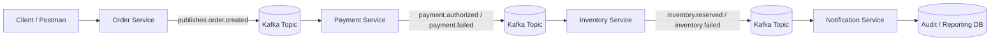

# 📦 Event-Driven Order Platform QA

> Demonstrates how to test modern event-driven systems by validating asynchronous workflows, event integrity, and end-to-end business outcomes across distributed services.

---

## 🧠 Architecture Overview


*Figure: End-to-end event-driven order processing flow with QA validation points across API, events, and data layers.*

---

## 🎯 Objective

This repository showcases a **senior-level QA approach** to testing distributed, event-driven systems.

It focuses on validating:

* Event publishing and consumption
* Asynchronous workflow behavior
* End-to-end business flow correctness
* Data integrity across services
* Failure handling and recovery mechanisms

---

## 🧠 System Overview

The platform simulates an **event-driven order processing system**, where services communicate via events instead of direct API calls.

### Event Flow

```text
Order Service → Payment Service → Inventory Service → Notification Service
```
## Logical flow

### Event Sequence

1. `order.created`
2. `payment.authorized` / `payment.failed`
3. `inventory.reserved` / `inventory.failed`
4. `notification.sent`

---

## 🧪 What This Project Covers

### ✅ Functional Testing

* API-triggered order creation
* Event publishing validation
* Consumer processing verification

### 🔁 Asynchronous Workflow Testing

* Event sequencing validation
* Eventual consistency checks
* Cross-service data validation

### ⚠️ Negative & Edge Case Testing

* Duplicate events (idempotency)
* Invalid payload handling
* Out-of-order events
* Partial failure scenarios

### 🔄 Resilience & Reliability Testing

* Retry mechanisms
* Poison message handling
* Dead-letter flow simulation
* Consumer recovery scenarios

### 📊 Data Integrity & Reconciliation

* Order vs Payment vs Inventory consistency
* Final state validation
* Audit/log verification

---

## 📁 Repository Structure

```text
event-driven-order-platform-qa/
│
├── docs/                  # Architecture diagram, test strategy, AsyncAPI
├── test-artifacts/        # Excel test cases (OpenMRS-style), RTM, reports
├── postman/               # API collections
├── automated-tests/       # Node.js test scripts
├── sql/                   # Data validation queries
├── docker/                # Optional local environment setup
└── README.md
```

---

## 📊 Test Artifacts (OpenMRS-Inspired Template)

The test pack follows a structured manual QA format inspired by healthcare system testing, adapted for event-driven systems.

Includes:

* Test Cases (functional, negative, edge, recovery, E2E)
* Execution Report
* Defect Log
* Requirement Traceability Matrix (RTM)
* Automation Mapping
* Summary Dashboard (pass rate, coverage)

---

## ⚙️ Tools & Technologies

* API Testing: Postman
* Automation: Node.js (JavaScript)
* Event Streaming: Kafka (conceptual / optional)
* Data Validation: SQL
* Environment: Docker (optional)

---

## 💡 Why This Matters

Modern platforms are increasingly **event-driven and distributed**, where:

* services operate asynchronously
* failures are partial and non-linear
* data consistency is eventual

This project demonstrates how QA goes beyond UI/API testing and validates:

👉 **complete system behavior across events, services, and data layers**

---

## 🧾 Key QA Focus Areas

* End-to-end workflow validation
* Event payload and contract verification
* Idempotency and duplicate protection
* Failure isolation and recovery
* Data consistency across distributed systems

---

## 📌 Sample Scenarios Covered

* Order creation triggers event
* Payment success/failure handling
* Duplicate event prevention
* Inventory reservation logic
* Out-of-order event handling
* Retry and recovery flows
* Final state reconciliation

---

## 🧑‍💻 About Me

Senior QA Engineer with 20+ years of experience across FinTech, SaaS, IoT, and enterprise systems.

Specializing in:

* End-to-end system validation
* Data integrity and transaction flows
* API and backend testing
* Event-driven and distributed systems

---

## ⚠️ Disclaimer

This project is a **simulation for learning and portfolio purposes only**.

All workflows, data, and implementations are generalized and do not include any proprietary or confidential information.
