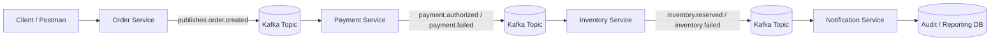

# Architecture Overview

## Purpose
This project simulates QA validation for an asynchronous order platform.

## Logical flow

## QA focus areas
- API request and response validation
- Event payload integrity
- Correct event sequencing
- Duplicate event handling
- Retry and recovery behavior
- Final-state reconciliation

## Key non-functional risks
- Duplicate processing
- Out-of-order event arrival
- Poison messages
- Eventual consistency delays
- Partial failure between services

