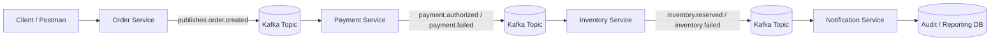

# 🏗️ Architecture Overview

## 🎯 Purpose
This project simulates **QA validation for an event-driven, asynchronous order processing platform**, focusing on how distributed services interact through events and how QA ensures **data integrity, system reliability, and correct business outcomes**.

## 🧠 Architecture Overview

*Figure: End-to-end event-driven order processing flow with QA validation points across API, events, and data layers.*

---

## Logical flow

## 🧪 QA Focus Areas

This project demonstrates how QA validates end-to-end behavior in asynchronous systems, not just individual APIs:

- API request and response validation
- Event payload structure and contract validation
- Event publishing and consumption verification
- Correct event sequencing across services
- Idempotency and duplicate event handling
- Retry, recovery, and failure isolation
- End-to-end workflow validation
- Final-state data reconciliation (DB vs events)

## ⚠️ Key Non-Functional Risks

Event-driven systems introduce risks that traditional testing often misses:

- Duplicate event processing (idempotency issues)
- Out-of-order event arrival
- Poison messages blocking consumers
- Eventual consistency delays
- Partial failures between services
- Data inconsistency across distributed components

## 🧠 QA Perspective

In this architecture, QA is not limited to validating API responses.

Instead, QA ensures:

The system produces the correct final business outcome, even when processing is asynchronous, distributed, and failure-prone.

This requires validating:

- Event lifecycle (publish → consume → outcome)
- System state transitions
- Cross-service data consistency
- Resilience under failure conditions

## 💡 Summary

This architecture represents a typical event-driven workflow where services communicate asynchronously via Kafka.

It highlights how QA must evolve from simple API validation to full system validation across distributed services, ensuring that business workflows remain correct even under complex, real-world conditions.
